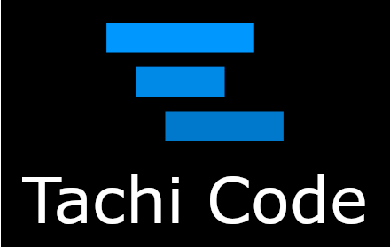

**Turn your browser into a code editor**

## Features

### 🔧 Interactive Source Files Everywhere
Automatically detects source files in your browser and opens them in a powerful code editor. Whether you're viewing an API response, source code on GitHub, or any other source file, Tachi Code transforms your browser tab into a fully functional editing environment.

### ✏️ Rich Editing Experience
- Built on the **Monaco Editor** (the same editor that powers Visual Studio Code)
- LSP support for select languages
- High-quality syntax highlighting powered by **Shiki**
- Support for a wide range of programming languages

### 🎯 Contextual Integrations
- Compare text with the clipboard
- Edit SVG files directly from your browser
- View page or selected element source in Tachi Code
- Open selected text in Tachi Code for quick modifications

### 👀 Live Preview
Real-time preview support for:
- Markdown files
- Mermaid diagrams
- SVG files

### 🎨 Deep Customization 
- Includes several built-in themes
- Additional themes available in the [Tachi Code themes repository](https://github.com/tachi-code/themes)
- Fully customizable editor experience

## Installation

Get Tachi Code from your browser's extension store:
* [Chrome Web Store](https://chromewebstore.google.com/detail/tachi-code/acoecgiamdjjkhmdodcfdfanfnagamjf)
* [Firefox Add-ons](https://addons.mozilla.org/en-US/firefox/addon/tachi-code/)

> [!NOTE]  
> Want to see Tachi Code packaged for a different browser? Let us know by [opening a browser packaging request](https://github.com/tachi-code/tachi-code/issues/new?template=browser-packaging-request)

## Try It Online

Try the Tachi Code editor without installing the browser extension at [TachiCode.dev](https://tachicode.dev).

## Frequently Asked Questions

**Is Tachi Code just VS Code in a trench coat?**  
Nope! Tachi Code's editor is built on top of the Monaco Editor, but the rest of the application is built from the ground up in React. It makes use of some underlying VS Code Core components, especially the theme system.

**How does Tachi Code handle file saving?**  
Tachi Code does not save files directly to your local filesystem. Instead, it provides a way to edit files in your browser and copy the changes to your clipboard or download them as a file. File contents are not persisted between sessions, so you'll need to save your changes manually.

**What data does Tachi Code collect?**  
The Tachi Code browser extension does not currently collect any data. [TachiCode.com](https://tachicode.com) and [TachiCode.dev](https://tachicode.dev) use Cloudflare's analytics beacon to collect basic usage statistics, such as page views and unique visitors outside the EU.

**Can I use Tachi Code offline?**  
Yes, the Tachi Code browser extension has been designed to work offline. However, some features, such as downloading themes or JSON schemas, require an internet connection.

## Issues and Support

This repository serves as the public issue tracker for Tachi Code. Since Tachi Code is currently closed-source, please use this space to:

- 🐛 Report bugs and issues ([issues](https://github.com/tachi-code/tachi-code/issues?template=bug_report))
- 💡 Request new features ([issues](https://github.com/tachi-code/tachi-code/issues?template=feature_request)/[discussions](https://github.com/tachi-code/tachi-code/discussions/categories/ideas))
- 📖 Ask questions about usage ([discussions](https://github.com/tachi-code/tachi-code/discussions/categories/q-a))
- 💬 Provide feedback ([discussions](https://github.com/tachi-code/tachi-code/discussions/categories/general))

## Links

- 🌐 [Official Website](https://tachicode.com)
- 🚀 [Try Online](https://tachicode.dev)
- 🎨 [Themes Repository](https://github.com/tachi-code/themes)
- 📚 [Documentation](https://tachicode.com/docs)

---

*Tachi Code is a closed-source project. This repository is maintained for community support and issue tracking.*